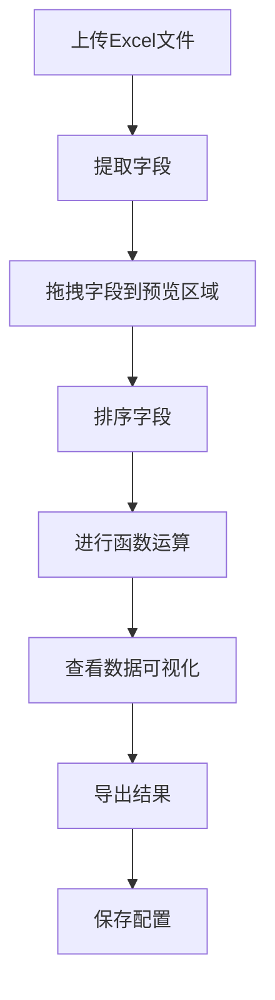

## 1. Product Overview
数据分析工具，用于处理Excel文件、提取字段、进行数据操作和可视化分析。
- 解决用户快速处理和分析多个Excel文件数据的问题，无需编程知识
- 目标用户为需要进行数据处理和分析的业务人员、分析师和学生

## 2. Core Features

### 2.1 User Roles
| Role | Registration Method | Core Permissions |
|------|---------------------|------------------|
| Normal User | 无需注册 | 完整使用所有功能 |

### 2.2 Feature Module
1. **数据处理页面**：文件上传、字段提取、拖拽预览、字段排序、函数运算
2. **数据可视化页面**：图表生成、数据预览、统计分析
3. **导出页面**：结果导出、配置保存

### 2.3 Page Details
| Page Name | Module Name | Feature description |
|-----------|-------------|---------------------|
| 数据处理页面 | 文件上传 | 支持上传多个Excel文件，显示文件列表和基本信息 |
| 数据处理页面 | 字段提取 | 从每个Excel文件中提取字段，显示字段名称和预览数据 |
| 数据处理页面 | 拖拽预览 | 支持将字段拖拽到中间预览区域，实时显示数据 |
| 数据处理页面 | 字段排序 | 支持对不同表格的字段进行排序操作 |
| 数据处理页面 | 函数运算 | 在右侧面板进行字段间的函数运算，生成新列 |
| 数据可视化页面 | 图表生成 | 支持基本的数据可视化图表类型（柱状图、折线图、饼图等） |
| 数据可视化页面 | 数据预览 | 显示处理后的数据表格，包含统计信息 |
| 数据可视化页面 | 统计分析 | 在表格最后一行显示最高值、最低值、平均值、求和、计数等统计信息 |
| 导出页面 | 结果导出 | 将处理后的数据导出为新的Excel文件 |
| 导出页面 | 配置保存 | 保存当前的处理配置，方便下次使用 |

## 3. Core Process
用户流程：上传Excel文件 → 提取字段 → 拖拽字段到预览区域 → 排序字段 → 进行函数运算 → 查看数据可视化 → 导出结果

## 4. User Interface Design
### 4.1 Design Style
- 主色调：#4361ee（蓝色）、#3a0ca3（深紫色）
- 辅助色：#4cc9f0（浅蓝色）、#f72585（粉色）
- 按钮风格：圆角按钮，有轻微的阴影效果
- 字体：Inter，大小从12px到24px
- 布局风格：卡片式布局，清晰的分区
- 图标风格：线性图标，简洁现代

### 4.2 Page Design Overview
| Page Name | Module Name | UI Elements |
|-----------|-------------|-------------|
| 数据处理页面 | 文件上传 | 拖放区域，文件列表卡片，上传按钮 |
| 数据处理页面 | 字段提取 | 字段列表，搜索框，字段预览 |
| 数据处理页面 | 拖拽预览 | 中间预览区域，表格样式，拖拽指示器 |
| 数据处理页面 | 字段排序 | 排序按钮，拖拽排序，排序指示器 |
| 数据处理页面 | 函数运算 | 右侧面板，函数选择器，字段选择器，运算预览 |
| 数据可视化页面 | 图表生成 | 图表类型选择，图表预览，图表配置 |
| 数据可视化页面 | 数据预览 | 表格展示，分页控制，筛选功能 |
| 数据可视化页面 | 统计分析 | 统计行，高亮显示，数据格式化 |
| 导出页面 | 结果导出 | 导出按钮，格式选择，导出进度 |
| 导出页面 | 配置保存 | 保存按钮，配置名称输入，配置列表 |

### 4.3 Responsiveness
- 桌面优先设计，支持响应式布局
- 在平板设备上调整为双列布局
- 在移动设备上调整为单列布局，使用抽屉菜单
- 支持触摸操作，优化拖拽体验

### 4.4 3D Scene Guidance
- 不适用，本产品为2D数据处理工具