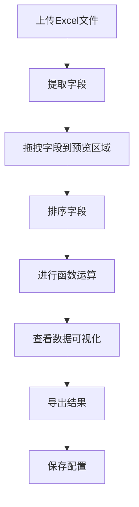

## 1. Product Overview
Excel数据分析工具，提供专业级数据处理和可视化功能，具有现代美观的用户界面。
- 解决用户快速处理和分析多个Excel文件数据的问题，无需编程知识
- 目标用户为需要进行数据处理和分析的业务人员、分析师和学生，提供专业且美观的工具

## 2. Core Features

### 2.1 User Roles
| Role | Registration Method | Core Permissions |
|------|---------------------|------------------|
| Normal User | 无需注册 | 完整使用所有功能 |

### 2.2 Feature Module
1. **数据处理页面**：文件上传、字段提取、拖拽预览、字段排序、函数运算
2. **数据可视化页面**：图表生成、数据预览、统计分析
3. **导出页面**：结果导出、配置保存

### 2.3 Page Details
| Page Name | Module Name | Feature description |
|-----------|-------------|---------------------|
| 数据处理页面 | 文件上传 | 支持上传多个Excel文件，显示文件列表和基本信息，具有拖放区域和文件预览 |
| 数据处理页面 | 字段提取 | 从每个Excel文件中提取字段，显示字段名称和预览数据，支持字段搜索和筛选 |
| 数据处理页面 | 拖拽预览 | 支持将字段拖拽到中间预览区域，实时显示数据，具有流畅的拖拽动画效果 |
| 数据处理页面 | 字段排序 | 支持对不同表格的字段进行排序操作，具有直观的排序指示器 |
| 数据处理页面 | 函数运算 | 在右侧面板进行字段间的函数运算，生成新列，提供常用函数库 |
| 数据可视化页面 | 图表生成 | 支持多种数据可视化图表类型（柱状图、折线图、饼图、散点图等），具有美观的图表样式 |
| 数据可视化页面 | 数据预览 | 显示处理后的数据表格，包含统计信息，支持分页和筛选 |
| 数据可视化页面 | 统计分析 | 在表格最后一行显示最高值、最低值、平均值、求和、计数等统计信息，具有高亮显示 |
| 导出页面 | 结果导出 | 将处理后的数据导出为新的Excel文件，支持多种格式选择 |
| 导出页面 | 配置保存 | 保存当前的处理配置，方便下次使用，支持配置管理 |

## 3. Core Process
用户流程：上传Excel文件 → 提取字段 → 拖拽字段到预览区域 → 排序字段 → 进行函数运算 → 查看数据可视化 → 导出结果

## 4. User Interface Design
### 4.1 Design Style
- 主色调：#3b82f6（蓝色）、#1e40af（深蓝色）
- 辅助色：#8b5cf6（紫色）、#ec4899（粉色）、#10b981（绿色）
- 按钮风格：圆角按钮，具有渐变效果和微妙的阴影，悬停时有平滑过渡效果
- 字体：使用Inter作为主要字体，搭配适当的字重和大小层次
- 布局风格：现代卡片式布局，具有适当的留白和层次感，采用网格系统
- 图标风格：使用Lucide React图标库，简洁现代，支持动态效果
- 动效：平滑的过渡动画，包括页面切换、元素加载、拖拽操作等
- 背景：使用微妙的渐变背景或纹理，增强视觉深度

### 4.2 Page Design Overview
| Page Name | Module Name | UI Elements |
|-----------|-------------|-------------|
| 数据处理页面 | 文件上传 | 现代化拖放区域，具有渐变边框和图标，上传后显示文件卡片，包含文件名、大小、预览缩略图 |
| 数据处理页面 | 字段提取 | 侧边栏字段列表，具有搜索框和分类功能，字段项具有悬停效果和拖拽指示器 |
| 数据处理页面 | 拖拽预览 | 中间大型预览区域，具有现代化表格样式，支持斑马纹、悬停高亮，拖拽时显示动态引导线 |
| 数据处理页面 | 字段排序 | 表格头部排序按钮，具有排序方向指示，支持多字段排序，排序时显示动画效果 |
| 数据处理页面 | 函数运算 | 右侧控制面板，具有函数分类和搜索，参数输入区域，实时预览结果，具有优雅的表单设计 |
| 数据可视化页面 | 图表生成 | 顶部图表类型选择器，具有直观的图标，图表区域具有适当的边距和背景，支持交互操作 |
| 数据可视化页面 | 数据预览 | 响应式数据表格，支持列宽调整，行高自适应，具有现代分页控件 |
| 数据可视化页面 | 统计分析 | 表格底部统计行，使用不同颜色区分不同统计类型，支持数据格式化和单位显示 |
| 导出页面 | 结果导出 | 大型导出按钮，具有渐变效果，格式选择下拉菜单，导出进度条和状态提示 |
| 导出页面 | 配置保存 | 配置列表卡片，具有保存、加载、删除功能，支持配置重命名和描述 |

### 4.3 Responsiveness
- 桌面优先设计，支持响应式布局
- 在平板设备上调整为双列布局，优化触摸操作
- 在移动设备上调整为单列布局，使用抽屉菜单和底部导航
- 支持触摸操作，优化拖拽体验，增大点击区域
- 图表和表格在小屏幕上自动调整大小和布局

### 4.4 3D Scene Guidance
- 不适用，本产品为2D数据处理工具，但可以考虑使用微妙的3D效果增强用户体验