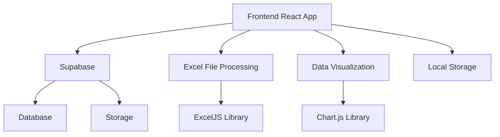
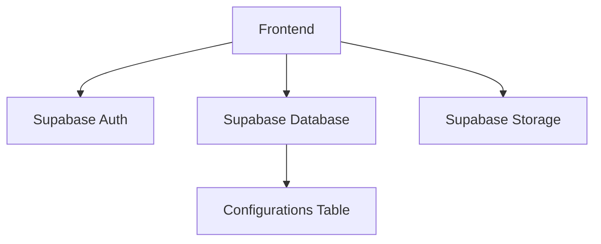
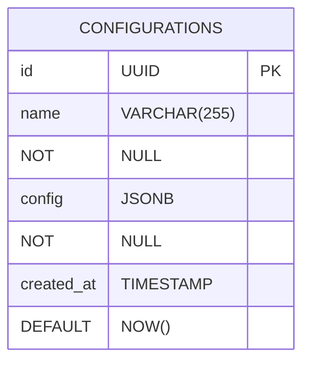

## 1. Architecture Design


## 2. Technology Description
- Frontend: React@18 + tailwindcss@3 + vite
- Initialization Tool: vite-init
- Backend: Supabase
- Database: Supabase (PostgreSQL)
- Libraries:
  - exceljs: For Excel file processing
  - chart.js: For data visualization
  - react-dnd: For drag-and-drop functionality
  - zustand: For state management

## 3. Route Definitions
| Route | Purpose |
|-------|---------|
| / | 数据处理页面 |
| /visualization | 数据可视化页面 |
| /export | 导出页面 |

## 4. API Definitions
### 4.1 Supabase API
- **保存配置**:
  - Method: POST
  - Endpoint: /configurations
  - Request: { name: string, config: object }
  - Response: { id: string, name: string, config: object, created_at: timestamp }

- **获取配置列表**:
  - Method: GET
  - Endpoint: /configurations
  - Response: [{ id: string, name: string, config: object, created_at: timestamp }]

- **获取配置详情**:
  - Method: GET
  - Endpoint: /configurations/{id}
  - Response: { id: string, name: string, config: object, created_at: timestamp }

- **删除配置**:
  - Method: DELETE
  - Endpoint: /configurations/{id}
  - Response: { success: boolean }

## 5. Server Architecture Diagram


## 6. Data Model
### 6.1 Data Model Definition


### 6.2 Data Definition Language
```sql
-- Create configurations table
CREATE TABLE configurations (
    id UUID PRIMARY KEY DEFAULT gen_random_uuid(),
    name VARCHAR(255) NOT NULL,
    config JSONB NOT NULL,
    created_at TIMESTAMP DEFAULT NOW()
);

-- Grant permissions
GRANT SELECT ON configurations TO anon;
GRANT ALL PRIVILEGES ON configurations TO authenticated;

-- Create RLS policies
CREATE POLICY "Allow public read access" ON configurations
    FOR SELECT USING (true);

CREATE POLICY "Allow authenticated users to insert" ON configurations
    FOR INSERT WITH CHECK (auth.role() = 'authenticated');

CREATE POLICY "Allow authenticated users to update their own" ON configurations
    FOR UPDATE USING (auth.role() = 'authenticated');

CREATE POLICY "Allow authenticated users to delete their own" ON configurations
    FOR DELETE USING (auth.role() = 'authenticated');
```